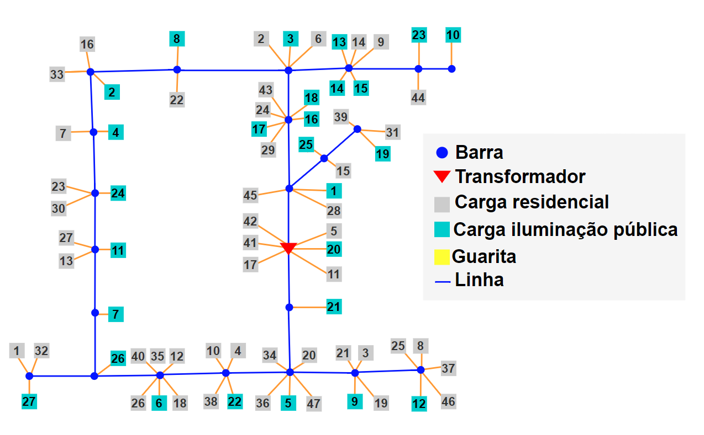
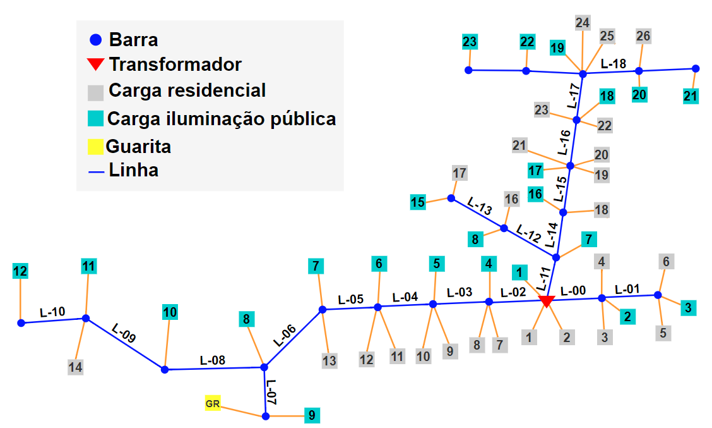

# NetworkSim-CA744-CA746
Project developed during the master's course in electrical engineering of the postgraduate program in electrical engineering at UFAM.

## Objectives

Using the [OpenDSS](https://www.epri.com/pages/sa/opendss), [py-dss-interface](https://github.com/PauloRadatz/py_dss_interface) and [OpenDssDirect](https://github.com/dss-extensions/OpenDSSDirect.py) to carry 
out simulations in CA744 and CA746 networks focusing on the analysis of distributed generation and the demand generated 
by electric vehicles on the electrical grid.

|                CA744                |                CA746                |
|:-----------------------------------:|:-----------------------------------:|
|  |  |

## Running this project


## Important commands

```sh
ps aux | grep main.py
ps -p $(cat script_pid.txt)
kill $(cat script_pid.txt)
watch -n 1 df -h /ponto/de/montagem
```

## Licence

